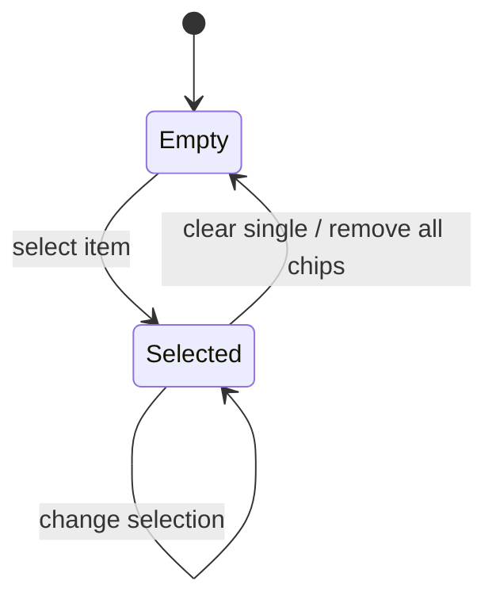
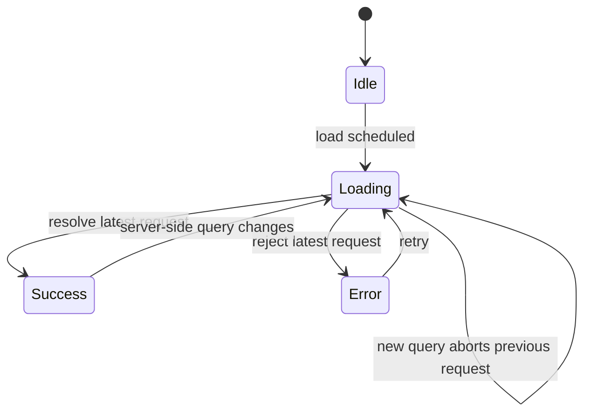

# Select（select）

> Status: Implemented
> Owner: easy-shadcn maintainers
> Created: 2026-06-02
> Related: [Select docs](../../content/docs/components/select.mdx)

## Context

easy-shadcn 的 Compose 层需要一个覆盖常见选择场景的 Select：plain dropdown、searchable dropdown、multiple chips，以及远程加载。底层 `components/ui/combobox` 保留 compound component 自由度，`registry/ui/select.tsx` 提供 80% 场景的 flat-props API。

当前交互合同里，`clearable` 需要同时满足两个目标：

- 鼠标用户只有移动到右侧 icon 区域时才看到 clear 按钮，避免整个 trigger hover 都闪出破坏扫描体验。
- 键盘用户在组件 focus-within 且已有值时仍能访问 clear 按钮。

## Goals & Non-Goals

Goals:

- 用单个 `Select` 覆盖 plain、searchable、multiple 三种常见模式。
- 保持 `value` / `defaultValue` / `onValueChange` 的模式化类型合同。
- 支持静态 items、eager async loading、server-side search。
- 让 `clearable` 在所有模式中行为一致：有值、可清空、右侧 adornment hover 或 focus-within 时显示 clear。
- 保持 `registry/ui/**` Compose 层封装，不改 `components/ui/**` 原语。

Non-Goals:

- 不提供 render prop、slots、`xxxProps` 透传或任意插槽插入点。
- 不替代复杂 combobox 场景；复杂组合应直接使用 `components/ui/combobox`。
- 不在 Select 内实现虚拟列表、分组、创建新选项或高级模糊搜索。
- 不新增服务端 API；远程搜索只通过调用方传入的 `loadItems` 完成。

## User Stories

- As an app developer, I want to pass `items` and get a plain select, so that simple forms do not require combobox composition.
- As an app developer, I want to enable `searchable`, so that users can filter a longer option list.
- As an app developer, I want to enable `multiple`, so that users can select several values and see chips.
- As an app developer, I want to pass `loadItems`, so that options can come from remote data.
- As a mouse user, I want the clear button to appear only near the right-side icon, so that hovering the whole field does not change the control.
- As a keyboard user, I want clear to remain reachable on focus, so that the field is operable without a mouse.

## Functional Requirements (EARS)

### Modes

- WHEN `multiple` is absent or `false` and `searchable` is absent or `false` THE SYSTEM SHALL render a button-style plain dropdown trigger.
- WHEN `searchable` is `true` in single mode THE SYSTEM SHALL render an input-style combobox trigger.
- WHEN `multiple` is `true` THE SYSTEM SHALL render selected values as chips and keep an input available for filtering.
- WHEN `serverSideFilter` is `true` with `loadItems` THE SYSTEM SHALL behave as searchable even if `searchable` is not explicitly passed.
- WHEN `disabled` is `true` THE SYSTEM SHALL disable Select interaction.

### Value Contract

- IF the `value` prop exists THE SYSTEM SHALL treat the component as controlled ELSE THE SYSTEM SHALL store selection internally from `defaultValue`.
- WHEN single selection changes THE SYSTEM SHALL call `onValueChange` with `string | undefined`.
- WHEN multiple selection changes THE SYSTEM SHALL call `onValueChange` with `string[]`.
- WHEN clear is invoked in single mode THE SYSTEM SHALL emit `undefined`.
- WHEN clear is invoked in multiple mode THE SYSTEM SHALL emit `[]`.
- WHEN an item has `value === ""` THE SYSTEM SHALL treat it as a selected value, not as empty state.
- WHEN `open` is not `undefined` THE SYSTEM SHALL treat popover open state as controlled ELSE THE SYSTEM SHALL store open state internally from `defaultOpen`.
- WHEN popover open state changes THE SYSTEM SHALL call `onOpenChange(open)` if provided.
- WHEN `multiple` is `true`, `maxCount` is a positive number, and the current selection length reaches `maxCount` THE SYSTEM SHALL disable every unselected item while keeping selected items available for deselection.

### Clearable

- WHEN `clearable` is `false` THE SYSTEM SHALL NOT show the clear button.
- WHEN `clearable` is `true`, the field has a value, and the pointer enters the right-side adornment area THE SYSTEM SHALL show the clear button.
- WHEN `clearable` is `true`, the field has a value, and the pointer hovers trigger content outside the right-side adornment THE SYSTEM SHALL keep the clear button hidden.
- WHILE the component has focus within and has a value THE SYSTEM SHALL show the clear button for keyboard access.
- WHEN the clear button is shown THE SYSTEM SHALL reserve the same adornment frame size used by the down/search icon.

### Filtering And Loading

- WHEN `items` is provided without `loadItems` THE SYSTEM SHALL derive combobox string items from `SelectItem.value`.
- WHEN `filter` is omitted THE SYSTEM SHALL filter by case-insensitive `contains` against the string label produced from `SelectItem.label`, falling back to `SelectItem.value` for non-string and non-number labels.
- WHEN `filter` is provided THE SYSTEM SHALL call it with the full `SelectItem` and current query in static and eager-async modes.
- WHEN `loadItems` is provided and `serverSideFilter` is `false` THE SYSTEM SHALL load once according to `loadOn` and filter locally after that.
- WHEN `loadItems` is provided and `serverSideFilter` is `true` THE SYSTEM SHALL call `loadItems(query, signal)` on open and debounced input changes.
- WHEN a request starts THE SYSTEM SHALL clear stale visible async result items while preserving selected labels that are already known from the async cache.
- WHEN a newer request starts THE SYSTEM SHALL abort the previous request through `AbortController`.
- WHEN async results omit already-selected values that previously appeared in loaded results THE SYSTEM SHALL merge cached selected items back into the displayed collection.
- WHEN `loadItems` rejects THE SYSTEM SHALL render `errorMessage` or the default extracted error text and expose a retry action.

## State Machine

### Selection State



Derived values:

```ts
hasInput = multiple || searchable || (Boolean(loadItems) && serverSideFilter)
hasValue = Array.isArray(currentValue) ? currentValue.length > 0 : currentValue !== undefined
adornmentKind =
  clearable && hasValue && (adornmentHovered || focusWithin)
    ? "clear"
    : hasInput && focusWithin
      ? "search"
      : "down"
```

### Loading State



## Key Algorithms

### Item Derivation

`useSelectItems` builds the combobox collection in one pass:

```ts
for item in items:
  stringItems.push(item.value)
  itemIndex.set(item.value, item)
```

The same index powers selected labels, filtering, and item rendering.

### Async Selected Cache

When `loadItems` is enabled, loaded results can update a cache of `value -> SelectItem` for currently selected values. The displayed async list is the latest response plus any selected cached item missing from that response. This keeps chips and trigger labels stable while users search a narrower server result set.

The cache cannot invent labels for controlled values that have never appeared in loaded results. In that case the UI falls back to the raw value until the corresponding item is loaded.

## API Contracts

### `SelectItem`

| Field | Type | Required | Description |
| --- | --- | --- | --- |
| `label` | `ReactNode` | Yes | Display label. String and number labels are used directly for default filtering; other node types fall back to `value` unless a custom `filter` is provided. |
| `value` | `string` | Yes | Stable combobox value. Empty string is valid. |
| `disabled` | `boolean` | No | Disables the option. |
| `itemClassName` | `ClassValue` | No | Per-item className merged with `itemClassName`. |

### Core Props

| Prop | Contract |
| --- | --- |
| `items` | Static `SelectItem[]`; ignored when `loadItems` exists. |
| `loadItems` | `(query: string, signal: AbortSignal) => Promise<SelectItem[]>`. |
| `loadOn` | `"mount" \| "open"`; controls the first eager async load when `serverSideFilter` is `false`. |
| `serverSideFilter` | If `true`, disables client filtering and re-invokes `loadItems` for open/query changes. |
| `debounceMs` | Debounce for `loadItems` calls in server-side filter mode. |
| `loadingMessage` | Content shown while async loading is pending. |
| `errorMessage` | Content or formatter shown when `loadItems` rejects. |
| `value` | `string \| undefined` in single mode, `string[] \| undefined` in multiple mode. Prop presence means controlled, including `value={undefined}`. |
| `defaultValue` | Initial uncontrolled value using the same mode-specific shape as `value`. |
| `onValueChange` | Emits `string \| undefined` in single mode, `string[]` in multiple mode. |
| `multiple` | Enables chips and array values. |
| `maxCount` | Multiple-mode selection limit. Positive numbers disable unselected items once the limit is reached. |
| `searchable` | Enables input filtering in single mode. Implicit in multiple mode. |
| `clearable` | Enables the clear affordance on right adornment hover or focus-within when a value exists. |
| `placeholder` | Placeholder text shown when no value is selected. |
| `emptyMessage` | Content shown when no items match. |
| `disabled` | Disables Select interaction. |
| `open` / `defaultOpen` / `onOpenChange` | Controlled or uncontrolled popover open state. |
| `filter` | Custom filter predicate for static and eager-async modes. Ignored when `serverSideFilter` is `true`. |
| `name` | Native form field name passed to the combobox root. |

### Styling Props

| Prop | Contract |
| --- | --- |
| `className` | Root wrapper className. |
| `triggerClassName` | Trigger/input/chips-container className depending on mode. |
| `inputClassName` | Input className for searchable and multiple modes. |
| `contentClassName` | Popover content className. |
| `itemClassName` | Default item className merged with `SelectItem.itemClassName`. |
| `chipClassName` | Chip className in multiple mode. |
| `emptyClassName` | Empty-state className. |

## Key Design Decisions (ADR)

### ADR-1: Keep Select As Compose Layer Flat Props

**Decision**: `Select` exposes flat props over `components/ui/combobox`.

**Why**: The Compose layer serves the 80% case. Exposing compound slots or render props would blur the boundary with primitives and expand the API for uncommon layouts.

### ADR-2: Use Discriminated Props For Single vs Multiple

**Decision**: `multiple: true` selects the array-value prop contract; otherwise Select uses the single-value contract.

**Why**: Consumers get compile-time errors for mismatched value and callback shapes without runtime guessing.

### ADR-3: Derive Adornment Instead Of Storing Icon State

**Decision**: The visible adornment is derived from `clearable`, value presence, focus, hover, and input capability.

**Why**: Derived render state avoids effect synchronization and keeps React Compiler-friendly logic local to render.

### ADR-4: Scope Mouse Hover To The Right Adornment

**Decision**: Mouse hover sets clear visibility only from the right-side adornment area; focus-within remains a separate accessibility path.

**Why**: Whole-field hover makes the control visually change while the user is merely scanning or crossing the field. The right-side icon is the clear affordance location and should be the only pointer trigger.

### ADR-5: Preserve Known Selected Labels Across Async Searches

**Decision**: Async results are merged with cached selected items that have previously appeared in loaded results.

**Why**: Remote search often returns only the current query slice. Without a selected cache, chips and trigger labels would disappear while still selected. The cache is intentionally bounded to items the loader has actually returned, so the component does not guess labels for unknown controlled values.

## Acceptance Criteria

GIVEN a clearable single Select with a selected value
WHEN the pointer hovers trigger text outside the right-side adornment
THEN the clear button is not rendered.

GIVEN a clearable single Select with a selected value
WHEN the pointer hovers the right-side adornment
THEN the clear button is rendered.

GIVEN a clearable single Select with focus and a selected value
WHEN the field receives focus
THEN the clear button is rendered for keyboard access.

GIVEN a controlled single Select with `value={undefined}`
WHEN Base UI emits a clear action
THEN the component remains controlled and shows the placeholder.

GIVEN a single Select with an item whose value is `""`
WHEN that value is selected
THEN its label is rendered instead of the placeholder.

GIVEN a server-side searchable Select with visible previous results
WHEN a new query starts loading
THEN stale previous results disappear and the loading state is visible.

GIVEN an async multiple Select with selected chips whose items previously appeared in loaded results
WHEN a new async result omits those selected values
THEN selected chip labels remain visible.

GIVEN a multiple Select with `maxCount` reached
WHEN the list renders
THEN unselected options are disabled and selected options remain available for deselection.

## Out of Scope

- Grouped options.
- Virtualized large lists.
- Creatable options.
- Arbitrary custom trigger or list renderers.
- Editing shadcn primitives under `components/ui/**`.

## References

- [registry/ui/select.tsx](../../registry/ui/select.tsx)
- [registry/hooks/use-select-items.ts](../../registry/hooks/use-select-items.ts)
- [registry/hooks/use-select-loader.ts](../../registry/hooks/use-select-loader.ts)
- [registry/ui/select.test.tsx](../../registry/ui/select.test.tsx)
- [content/docs/components/select.mdx](../../content/docs/components/select.mdx)
