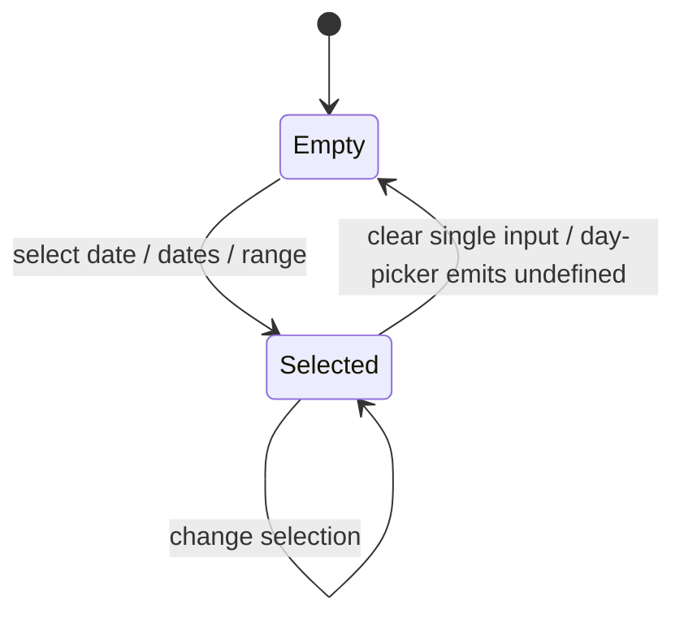
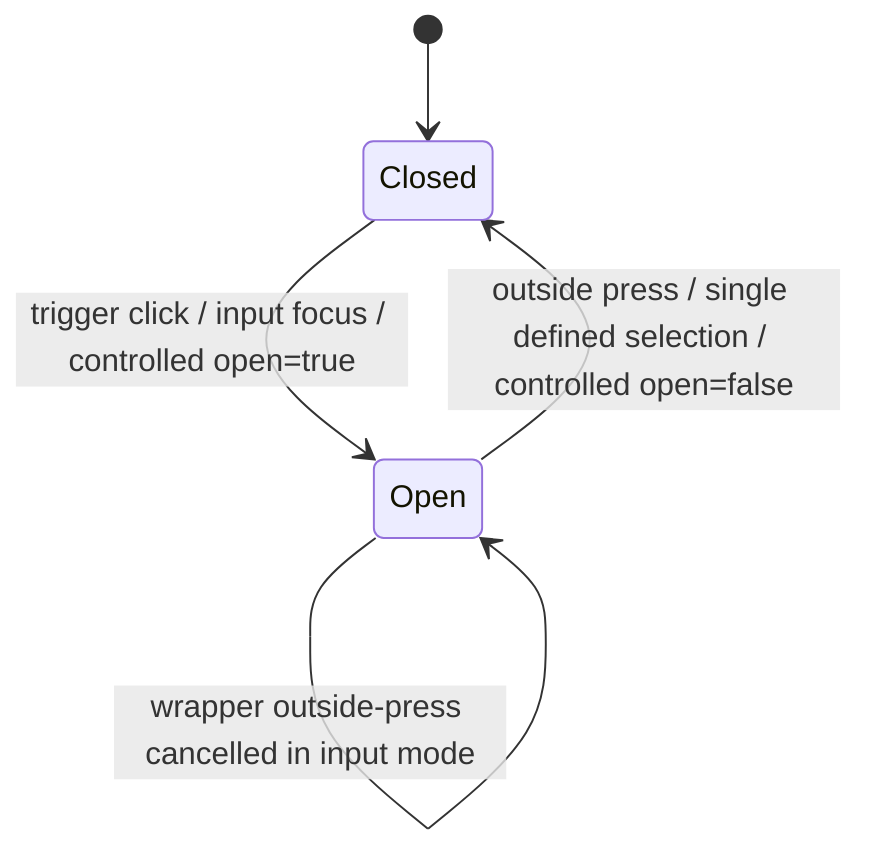

# Date Picker（date-picker）

> Status: Implemented
> Owner: easy-shadcn maintainers
> Created: 2026-06-10
> Related: [Date Picker docs](../../content/docs/components/date-picker.mdx), [Calendar docs](../../content/docs/components/calendar.mdx)

## Context

easy-shadcn 的 Compose 层需要一个覆盖常见日期选择场景的 Date Picker：单日期、多日期、日期范围，以及单日期手动输入。底层 `components/ui/popover`、`components/ui/input`、`components/ui/button` 和 `registry/ui/calendar.tsx` 保留组合自由度，`registry/ui/date-picker.tsx` 提供 80% 场景的 flat-props API。

当前实现的边界很窄：Date Picker 只管理触发器、popover open state、选中值、展示字符串和可选输入提交；月份/年份面板、日期网格、range/multiple 选择语义由 `Calendar` / `react-day-picker` 承担。

## Goals & Non-Goals

Goals:

- 用单个 `DatePicker` 覆盖 `single`、`multiple`、`range` 三种选择模式。
- 保持 `value` / `defaultValue` / `onChange` 的模式化类型合同。
- 支持 `date-fns` `format` 和 `locale`，并将 `locale` 同时用于展示格式化、输入解析和 Calendar。
- 在 single 模式支持 `withInput`，允许用户手动输入和提交日期。
- 让 `disabled` 禁止打开、输入和 Calendar 选择提交。
- 保持 Compose 层 flat props，不改 `components/ui/**` 原语。

Non-Goals:

- 不提供 render prop、slots、`xxxProps` 透传或任意插槽插入点。
- 不实现 multiple/range 的文本输入解析。
- 不在 Date Picker 内实现表单校验、错误提示或输入掩码。
- 不替代复杂 Calendar 场景；`minDate` / `maxDate` / `disabledDates` 之外的高级 range 规则、任意 DayPicker prop 或受控 month 时应直接组合 `Popover` + `Calendar`。

## User Stories

- As an app developer, I want to render a default single date picker, so that simple forms do not require Popover and Calendar composition.
- As an app developer, I want to pass `mode="multiple"`, so that users can select several independent dates.
- As an app developer, I want to pass `mode="range"`, so that users can select a contiguous date range.
- As an app developer, I want to enable `withInput` in single mode, so that users can type a formatted date by hand.
- As an app developer, I want to pass `format` and `locale`, so that displayed dates, typed dates, and calendar labels follow the same locale rules.

## Functional Requirements (EARS)

### Modes

- WHEN `mode` is absent THE SYSTEM SHALL use single-date mode.
- WHEN `mode` is `"single"` THE SYSTEM SHALL pass `mode="single"` and the current `Date | undefined` value to `Calendar`.
- WHEN `mode` is `"multiple"` THE SYSTEM SHALL pass `mode="multiple"` and the current `Date[] | undefined` value to `Calendar`.
- WHEN `mode` is `"range"` THE SYSTEM SHALL pass `mode="range"` and the current `DateRange | undefined` value to `Calendar`.
- WHEN `withInput` is `true` in single mode THE SYSTEM SHALL render an `Input` trigger plus a calendar icon button.
- WHEN `withInput` is absent or `false` THE SYSTEM SHALL render a button-style trigger.
- WHEN TypeScript consumers pass `withInput` with `mode="multiple"` or `mode="range"` THE SYSTEM SHALL reject that prop shape at compile time.

### Value Contract

- IF the `value` prop exists THE SYSTEM SHALL derive the selected value from `value` ELSE THE SYSTEM SHALL store selection internally from `defaultValue`.
- WHEN selection changes THE SYSTEM SHALL call `onChange(next)` if provided.
- WHEN selection changes and the component is uncontrolled THE SYSTEM SHALL update internal selection.
- WHEN single-mode selection changes to a defined date THE SYSTEM SHALL close the popover.
- WHEN single-mode selection changes to `undefined` THE SYSTEM SHALL keep the popover open.
- WHEN multiple-mode selection changes THE SYSTEM SHALL keep the popover open.
- WHEN range-mode selection changes THE SYSTEM SHALL keep the popover open.
- WHEN `defaultValue` changes after mount THE SYSTEM SHALL NOT resync internal selection from the new prop value.
- WHEN `disabled` is `true` THE SYSTEM SHALL ignore selection commits from Calendar and input.

### Open State

- IF `open` is not `undefined` THE SYSTEM SHALL derive popover open state from `open` ELSE THE SYSTEM SHALL store open state internally from `defaultOpen`.
- WHEN open state changes and `open` is `undefined` THE SYSTEM SHALL update internal open state.
- WHEN open state changes THE SYSTEM SHALL call `onOpenChange(next)` if provided.
- WHEN the popover closes THE SYSTEM SHALL bump `resetViewsKey` so the nested `Calendar` month/year panel views return to days.
- WHEN `withInput` is enabled and an outside-press event targets the Date Picker wrapper THE SYSTEM SHALL cancel that close event.
- WHEN `withInput` is enabled and the input receives focus or click THE SYSTEM SHALL open the popover.
- WHEN `disabled` is `true` THE SYSTEM SHALL ignore requests to open the popover.

### Display Formatting

- WHEN `format` is absent THE SYSTEM SHALL use the `date-fns` format string `"PPP"`.
- WHEN single-mode value is a valid date THE SYSTEM SHALL display `formatDate(value, format, { locale })`.
- WHEN multiple-mode value has at least one valid date THE SYSTEM SHALL display each formatted valid date joined by `", "`.
- WHEN range-mode value has a valid `from` and no valid `to` THE SYSTEM SHALL display `"<from> - ..."`.
- WHEN range-mode value has both valid `from` and valid `to` THE SYSTEM SHALL display `"<from> - <to>"`.
- WHEN no display value exists THE SYSTEM SHALL render `placeholder` or the mode default placeholder.
- WHEN `locale` is provided THE SYSTEM SHALL forward it to both date formatting and `Calendar`.

### Manual Input

- WHEN `withInput` is enabled THE SYSTEM SHALL render the input value as the current draft if present, otherwise the formatted display value.
- WHEN `withInput` is enabled THE SYSTEM SHALL expose popover relationship state through `aria-haspopup`, `aria-expanded`, and `aria-controls`.
- WHEN the input changes THE SYSTEM SHALL store the raw text as a draft value.
- WHEN focus leaves the entire Date Picker wrapper and popover content THE SYSTEM SHALL attempt to commit the draft.
- WHEN focus moves from the input into the Calendar popover THE SYSTEM SHALL NOT commit the draft before the Calendar interaction can run.
- WHEN the user presses Enter in the input THE SYSTEM SHALL prevent the default action and attempt to commit the draft.
- WHEN the draft is an empty string THE SYSTEM SHALL commit `undefined`.
- WHEN the draft parses with `parse(draft, format, new Date(), { locale })` and `isValid(parsed)` is true THE SYSTEM SHALL commit the parsed `Date`.
- WHEN the draft is invalid THE SYSTEM SHALL discard the draft without calling `onChange`.
- WHEN the draft parses to a valid date blocked by `minDate`, `maxDate`, or `disabledDates` THE SYSTEM SHALL discard the draft without calling `onChange`.
- WHEN the popover closes with reason `escape-key` THE SYSTEM SHALL discard the pending draft without committing.
- WHEN the popover closes for any other non-cancelled reason while a draft is pending THE SYSTEM SHALL attempt to commit the draft and call `onOpenChange(false)` exactly once.
- WHEN any input commit path finishes THE SYSTEM SHALL clear the draft.

### Disabled And Styling

- WHEN `disabled` is `true` THE SYSTEM SHALL disable the button trigger and, in input mode, both the `Input` and icon button.
- WHEN `disabled` is `true` THE SYSTEM SHALL pass an all-days disabled matcher to `Calendar`.
- WHEN button mode is used THE SYSTEM SHALL apply `className` and `triggerClassName` to the trigger button.
- WHEN input mode is used THE SYSTEM SHALL apply `className` to the wrapper and `inputClassName` plus `triggerClassName` to the input.
- WHEN input mode is used THE SYSTEM SHALL apply `iconButtonClassName` to the calendar icon button.
- WHEN `contentClassName` is provided THE SYSTEM SHALL merge it into `PopoverContent`.
- WHEN `calendarClassName` is provided THE SYSTEM SHALL merge it into `Calendar`.

### Calendar Integration

- WHEN `minDate` is provided THE SYSTEM SHALL disable Calendar days before it.
- WHEN `maxDate` is provided THE SYSTEM SHALL disable Calendar days after it.
- WHEN `disabledDates` is provided THE SYSTEM SHALL merge it with the `minDate`/`maxDate` matchers and forward the set to Calendar as disabled days.
- WHEN `startMonth` is provided THE SYSTEM SHALL prevent Calendar month navigation before that month, including the custom months panel.
- WHEN `endMonth` is provided THE SYSTEM SHALL prevent Calendar month navigation after that month, including the custom months panel.
- WHEN Calendar renders custom month or year panels THE SYSTEM SHALL expose listbox/option semantics and selected state.
- WHEN Calendar renders month/year panel navigation arrows THE SYSTEM SHALL provide accessible button names.

## State Machine

### Selection State



Derived values:

```ts
mode = props.mode ?? "single"
isValueControlled = "value" in props
currentValue = isValueControlled ? props.value : internalValue
withInput = mode === "single" && props.withInput === true
```

### Open State



Derived values:

```ts
currentOpen = props.open === undefined ? internalOpen : props.open
placeholderText = props.placeholder ?? PLACEHOLDERS[mode]
```

## Key Algorithms

### Display String Derivation

```ts
if (mode === "multiple") {
  display = value?.filter(isValid).map(formatDate).join(", ") ?? ""
} else if (mode === "range") {
  display = !isValid(value?.from)
    ? ""
    : isValid(value.to)
      ? `${formatDate(value.from)} - ${formatDate(value.to)}`
      : `${formatDate(value.from)} - ...`
} else {
  display = isValid(value) ? formatDate(value) : ""
}
```

### Commit

```ts
function commit(next, options) {
  if (props.disabled) return
  if (!isValueControlled) {
    setInternalValue(next)
  }

  props.onChange?.(next)
  setDraft(null)

  // currentOpen guard: blur commits (popover already closed) and
  // close-initiated commits ({ close: false }) must not re-close,
  // so onOpenChange fires exactly once per close.
  if (mode === "single" && next && currentOpen && options?.close !== false) {
    handleOpenChange(false)
  }
}
```

### Input Commit

```ts
if (draft === null) return
if (draft === "") commit(undefined)
else {
  const parsed = parse(draft, format, new Date(), { locale })
  // disabledMatchers = [{ before: minDate }, { after: maxDate }, ...disabledDates]
  if (isValid(parsed) && !dateMatchModifiers(parsed, disabledMatchers)) {
    commit(parsed, options)
  }
}
setDraft(null)
```

## API Contracts

### Mode Props

| Mode | `value` / `defaultValue` | `onChange` | `withInput` |
| --- | --- | --- | --- |
| `single` or omitted | `Date | undefined` | `(value: Date | undefined) => void` | `boolean` |
| `multiple` | `Date[] | undefined` | `(value: Date[] | undefined) => void` | `false` only |
| `range` | `DateRange | undefined` | `(value: DateRange | undefined) => void` | `false` only |

### Core Props

| Prop | Contract |
| --- | --- |
| `mode` | Selection mode. Defaults to `"single"`. |
| `value` | Controlled selected value. Prop presence means controlled, including `value={undefined}` for an empty controlled field. |
| `defaultValue` | Initial uncontrolled selected value. Read only on first render. |
| `onChange` | Called with the mode-specific selected value whenever `Calendar` selection or valid input commit changes. |
| `format` | `date-fns` format token used for display and single-mode input parsing. Defaults to `"PPP"`. |
| `locale` | `date-fns` locale forwarded to formatting, parsing, and `Calendar`. |
| `placeholder` | Overrides the mode default placeholder. |
| `disabled` | Disables trigger controls, prevents opening, blocks commits, and disables Calendar days when already open. |
| `withInput` | Single-mode-only input trigger. Enables typing, blur commit, Enter commit, and invalid-input discard. |
| `minDate` / `maxDate` | Inclusive selectable-day bounds. Disable out-of-range Calendar days and reject out-of-range typed input. |
| `disabledDates` | react-day-picker `Matcher \| Matcher[]` of unselectable days, merged with the `minDate`/`maxDate` matchers and enforced on typed input. |
| `id` | Applied to the trigger (button or input) for `<label htmlFor>` / Field association. |
| `name` | Native form name on the `withInput` text input (the formatted text is submitted). |
| `aria-describedby` / `aria-invalid` | Forwarded to the trigger (button or input). |
| `numberOfMonths` | Forwarded to `Calendar`. |
| `defaultMonth` | Forwarded to `Calendar`; when absent, Date Picker derives it from the current selected value. |
| `startMonth` | Forwarded to `Calendar` as the earliest navigable month. |
| `endMonth` | Forwarded to `Calendar` as the latest navigable month. |
| `open` | Controlled popover state only when not `undefined`. |
| `defaultOpen` | Initial uncontrolled popover state. |
| `onOpenChange` | Called after non-cancelled open state changes. |

### Styling Props

| Prop | Contract |
| --- | --- |
| `className` | Button mode: trigger button className. Input mode: wrapper className. |
| `triggerClassName` | Button mode: trigger button className. Input mode: input className. |
| `inputClassName` | Input className in `withInput` mode. |
| `iconButtonClassName` | Calendar icon button className in `withInput` mode. |
| `contentClassName` | Popover content className. |
| `calendarClassName` | Calendar className. |

### Exports

| Export | Contract |
| --- | --- |
| `DatePicker` | React component implementing `DatePickerProps`. |
| `DatePickerProps` | Discriminated union of single, multiple, and range prop shapes. |
| `DatePickerSingleProps` | Single-mode prop shape. |
| `DatePickerMultipleProps` | Multiple-mode prop shape. |
| `DatePickerRangeProps` | Range-mode prop shape. |
| `DateRange` | Re-export from `react-day-picker`. |

## Key Design Decisions (ADR)

### ADR-1: Keep Date Picker As A Compose Layer Wrapper

**Decision**: `DatePicker` wraps `Popover`, `Button`, `Input`, and `Calendar` with flat props.

**Why**: The Compose layer serves the common form-control case. Complex date rules beyond `minDate`/`maxDate`/`disabledDates`, custom layouts, or fully controlled Calendar month state should use the underlying primitives directly instead of expanding the Date Picker API.

### ADR-2: Restrict Manual Input To Single Mode

**Decision**: `withInput` is accepted only in single mode.

**Why**: A single date has one unambiguous formatted string. Multiple dates and ranges require separator conventions, partial-state handling, and locale-sensitive parsing that exceed the 80% Compose API.

### ADR-3: Auto-Close Only After Defined Single Selection

**Decision**: Single mode closes the popover after a defined date is committed; multiple and range modes stay open.

**Why**: Single selection is complete after one date. Multiple and range selection often require additional clicks, so closing would interrupt the expected workflow.

### ADR-4: Reset Calendar Panels On Close

**Decision**: Closing the popover increments `resetViewsKey`, causing the nested Calendar to return month/year panels to the day grid.

**Why**: Users should not reopen a date picker into an incidental month/year navigation panel from the previous interaction.

### ADR-5: Use Prop Presence As The Controlled/Uncontrolled Boundary

**Decision**: `DatePicker` treats the presence of the `value` prop as controlled, including `value={undefined}`.

**Why**: Form integrations commonly represent an empty controlled date as `undefined`. Prop-presence detection matches the existing Select contract and prevents controlled fields from falling back to stale internal state.

### ADR-6: Let Calendar Selection Win Over Pending Input Drafts

**Decision**: Input blur commits only when focus leaves both the input wrapper and popover content.

**Why**: Clicking the calendar naturally blurs the input first. If blur committed immediately, a valid typed draft could close the popover before the intended day click runs.

### ADR-7: Selectable-Day Constraints Are In Scope

**Decision**: `minDate`, `maxDate`, and `disabledDates` are dedicated flat props, forwarded to Calendar as disabled-day matchers and enforced on `withInput` commits.

**Why**: "No past/future dates" and "block specific days" are 80% production scenarios (deadlines, bookings, birthdays). Without input-commit enforcement, typing would bypass any calendar-side restriction. Arbitrary DayPicker prop forwarding stays out of scope.

### ADR-8: Escape Cancels The Pending Draft

**Decision**: Closing the popover via `escape-key` discards the pending input draft; every other close reason attempts to commit it.

**Why**: Escape conventionally means "abandon my edit". Committing on Escape would make the only cancel gesture destructive to the previous value.

## Acceptance Criteria

GIVEN a Date Picker without `mode`
WHEN it renders
THEN it uses single mode and displays `Pick a date` when empty.

GIVEN a controlled Date Picker with `value={undefined}`
WHEN a date is selected from the Calendar
THEN `onChange` receives the date and the trigger remains controlled by the empty external value.

GIVEN a single Date Picker
WHEN a date is selected from the Calendar
THEN `onChange` receives that `Date` and the popover closes.

GIVEN a multiple Date Picker
WHEN dates are selected from the Calendar
THEN `onChange` receives `Date[] | undefined` and the popover remains open.

GIVEN a range Date Picker
WHEN only `from` is selected
THEN the trigger displays the formatted start date followed by ` - ...`.

GIVEN a range Date Picker
WHEN both `from` and `to` are selected
THEN the trigger displays the formatted start and end dates separated by ` - `.

GIVEN a single Date Picker with `withInput`
WHEN the user types a valid date in the configured `format` and presses Enter
THEN `onChange` receives the parsed `Date`, the draft is cleared, and the popover closes.

GIVEN a single Date Picker with `withInput` and a pending valid draft
WHEN the input blurs because the user clicks a Calendar day
THEN the Calendar day selection wins and only that day is emitted.

GIVEN a single Date Picker with `withInput`
WHEN the user types an invalid date and blurs the field
THEN `onChange` is not called and the input reverts to the previous formatted value.

GIVEN a single Date Picker with `withInput`
WHEN the user clears the input and blurs the field
THEN `onChange` receives `undefined` and the draft is cleared.

GIVEN an uncontrolled Date Picker with `defaultValue`
WHEN `defaultValue` later changes
THEN the rendered selected value does not resync from the new default.

GIVEN a disabled Date Picker whose popover is already open
WHEN a Calendar day is clicked
THEN `onChange` is not called.

GIVEN a Date Picker with an open Calendar month/year panel
WHEN the popover closes and reopens
THEN the Calendar view is reset to the day grid.

GIVEN a Date Picker with `minDate` and `maxDate`
WHEN the calendar renders days outside the range
THEN those days are disabled and clicking them does not call `onChange`.

GIVEN a single Date Picker with `withInput` and `minDate` or `disabledDates`
WHEN the user types a blocked date and presses Enter
THEN `onChange` is not called and the input reverts.

GIVEN a single Date Picker with `withInput` and a pending edited draft
WHEN the user presses Escape
THEN `onChange` is not called and the input reverts to the previous formatted value.

GIVEN a single Date Picker with `withInput`, an open popover, and a pending valid draft
WHEN the popover closes
THEN `onChange` receives the parsed date and `onOpenChange(false)` fires exactly once.

GIVEN a Calendar opened to the months panel with `startMonth` and `endMonth`
WHEN months outside the bounds render
THEN those month options are disabled and cannot change the visible month.

## Out of Scope

- Arbitrary DayPicker prop forwarding beyond the dedicated `minDate` / `maxDate` / `disabledDates` props.
- Controlled visible Calendar month.
- Custom Calendar footer/header slots.
- Input masks and validation messages.
- Multiple-date or range text parsing.
- Time picking.

## References

- [Date Picker implementation](../../registry/ui/date-picker.tsx)
- [Calendar implementation](../../registry/ui/calendar.tsx)
- [Date Picker docs](../../content/docs/components/date-picker.mdx)
- [Calendar docs](../../content/docs/components/calendar.mdx)
