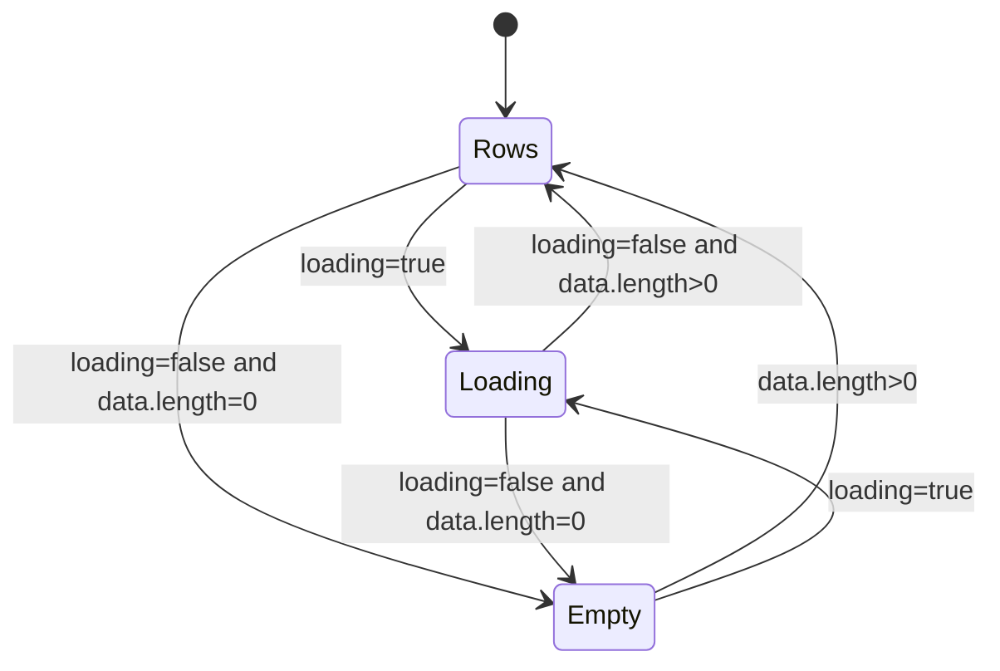
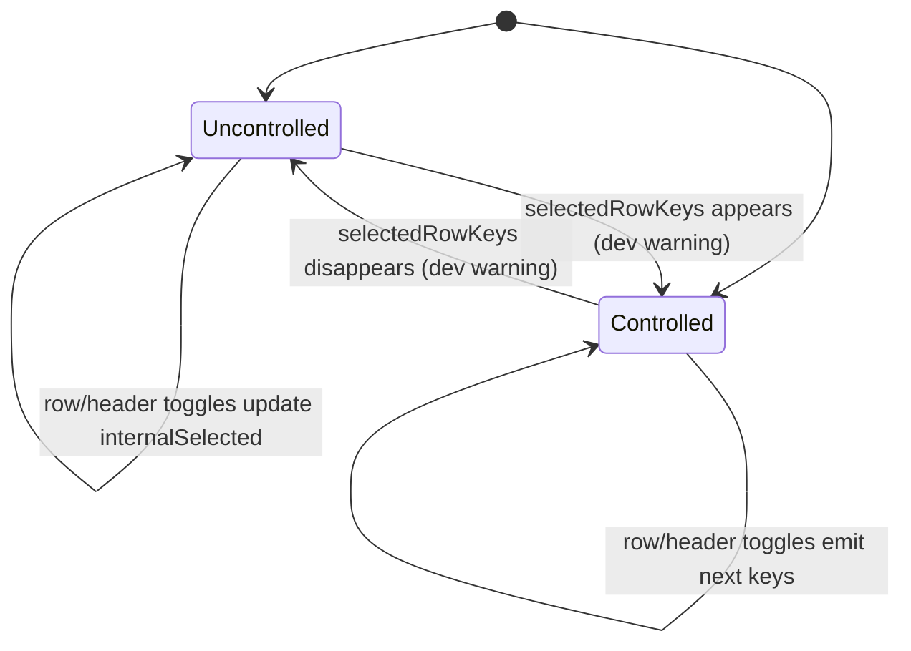
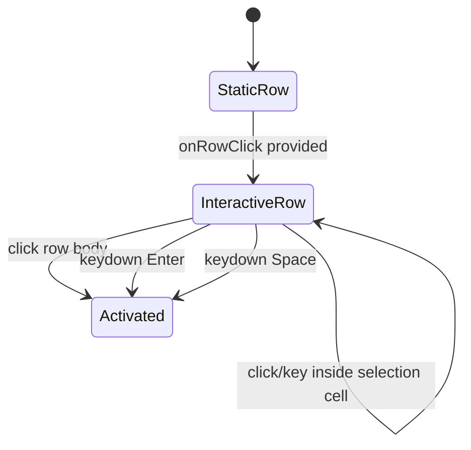

# Table（table）

> Status: Implemented
> Owner: easy-shadcn maintainers
> Created: 2026-06-10
> Related: [Table docs](../../content/docs/components/table.mdx)

## Context

easy-shadcn 的 Compose 层需要一个覆盖常见数据展示场景的 Table：调用方传入 `columns`、`dataSource`、`rowKey`，即可得到基于 shadcn table 原语的扁平 props API。

`components/ui/table` 保留 compound component 自由度；`registry/ui/table.tsx` 面向 80% 场景，内置 loading、empty、caption、行样式、列格式化、可选选择列和行点击。复杂表格能力继续留给调用方或原语组合。

选择列使用 Base UI Checkbox primitive 直接组合，而不是改 `components/ui/checkbox`。原因是 shadcn checkbox wrapper 的 indicator 固定为 tick，无法给 indeterminate 状态提供独立 dash 图标；同时 `components/ui/**` 在本仓库中严格只读。

## Goals & Non-Goals

Goals:

- 用单个 `Table` 覆盖 `columns` + `dataSource` + `rowKey` 的常见只读表格。
- 用 `defineColumns<T>()` 保持 `render(value, record, index)` 的 `value` 类型按 `dataIndex` 收窄，并在类型层要求非可渲染字段提供 `render`。
- 支持 loading、empty、caption、行级 className、列级 align / width / className。
- 支持左侧选择列，包括受控 / 非受控 selected keys、disabled row gating、header select-all、跨页 key 保留和 indeterminate 视觉。
- 支持 `onRowClick`，并保持鼠标和键盘可达。
- 在开发环境中暴露常见误用警告：重复 row key、无效 row key、重复 column key、无 accessible name、选择受控模式混用。

Non-Goals:

- 不提供排序、过滤、分页、虚拟列表、列拖拽、列 resize、展开行、固定列或 sticky header。
- 不内置 error state；异步失败由父组件决定如何展示。
- 不支持 nested path `dataIndex`，例如 `"user.name"`。
- 不提供 render prop、slots 或任意节点插入点。
- 不把 `Table` 做成 Server Component；当前实现是 `"use client"`。
- 不修改 `components/ui/**` 原语。

## User Stories

- As an app developer, I want to pass `columns`, `dataSource`, and `rowKey`, so that I can render a common data table without composing shadcn primitives manually.
- As an app developer, I want `render(value, record, index)` to receive a narrowed value type, so that cell formatting is type-safe.
- As an app developer, I want loading and empty states, so that async data can be represented without extra table markup.
- As an app developer, I want row selection with selected keys and selected records, so that bulk actions do not require a second lookup.
- As an app developer, I want to disable selection for specific rows, so that gated rows are skipped by select-all.
- As a keyboard user, I want clickable rows to be focusable and activated with Enter / Space, so that row navigation does not require a mouse.
- As a screen-reader user, I want table and selection controls to have accessible names, so that the table structure and actions are understandable.

## Functional Requirements (EARS)

### Core Rendering

- WHEN `Table` renders THE SYSTEM SHALL render a shadcn table root with `data-slot="easy-table"`.
- WHEN table HTML props are passed THE SYSTEM SHALL forward them to the `<table>` element, except `children`.
- WHEN a consumer passes `aria-busy` or `data-slot` THE SYSTEM SHALL keep the Table-managed values instead of allowing passthrough props to override them.
- WHEN `className` is passed THE SYSTEM SHALL apply it to the `<table>` element.
- WHEN `caption` is truthy THE SYSTEM SHALL render it inside `<caption>`.
- WHEN `captionClassName` is passed THE SYSTEM SHALL apply it to `<caption>`.
- WHEN `headerClassName` is passed THE SYSTEM SHALL apply it to `<thead>`.
- WHEN `bodyClassName` is passed THE SYSTEM SHALL apply it to `<tbody>`.
- WHEN `dataSource` is `null`, `undefined`, or omitted THE SYSTEM SHALL treat it as an empty array.
- WHEN `loading` is `true` THE SYSTEM SHALL render exactly one body row containing `loadingMessage`.
- WHEN `loading` is `true` THE SYSTEM SHALL NOT render data rows or the empty state.
- WHEN `loading` is false and `dataSource` is empty THE SYSTEM SHALL render exactly one body row containing `emptyMessage`.
- WHEN loading or empty state renders THE SYSTEM SHALL set the placeholder cell `colSpan` to `columns.length + 1` if selectable, otherwise `columns.length`.
- WHEN `loadingMessage` is omitted THE SYSTEM SHALL use `"Loading…"`.
- WHEN `emptyMessage` is omitted THE SYSTEM SHALL use `"No data"`.

### Columns

- WHEN a column renders THE SYSTEM SHALL use `column.key` as the React key for its header and body cells.
- WHEN two columns share the same `key` in development THE SYSTEM SHALL warn once for that duplicate-key fingerprint.
- WHEN `dataIndex` is provided THE SYSTEM SHALL read the cell value from `record[dataIndex]`.
- WHEN `dataIndex` is omitted THE SYSTEM SHALL pass `undefined` as the cell value.
- WHEN `render` is provided THE SYSTEM SHALL render `render(value, record, index)`.
- WHEN `render` is omitted THE SYSTEM SHALL render the raw value as `ReactNode`.
- WHEN `dataIndex` points to a field whose type is not assignable to `ReactNode` THE SYSTEM SHALL require `render` at compile time.
- WHEN `align` is `"center"` THE SYSTEM SHALL apply `text-center` to the header and body cells.
- WHEN `align` is `"right"` THE SYSTEM SHALL apply `text-right` to the header and body cells.
- WHEN `align` is `"left"` or omitted THE SYSTEM SHALL NOT add an alignment class.
- WHEN `width` is provided THE SYSTEM SHALL emit it as inline `style.width` on both header and body cells.
- WHEN `className` is provided on a column THE SYSTEM SHALL apply it to both header and body cells.
- WHEN `headClassName` is provided THE SYSTEM SHALL apply it only to the header cell.
- WHEN `cellClassName` is provided THE SYSTEM SHALL apply it only to body cells.

### Row Keys And Diagnostics

- WHEN `rowKey` is a function THE SYSTEM SHALL use `rowKey(record, index)` stringified as the row key.
- WHEN `rowKey` is a field name THE SYSTEM SHALL allow only string / number fields at compile time and use `record[rowKey]` stringified as the row key.
- WHEN duplicate row keys are detected in development THE SYSTEM SHALL warn once per duplicate-key fingerprint.
- WHEN a row key resolves to `null` or `undefined` in development THE SYSTEM SHALL warn once.
- WHEN a row key resolves to a `Symbol` in development THE SYSTEM SHALL warn once.
- WHEN a row key resolves to another non-string / non-number value in development THE SYSTEM SHALL warn once.
- WHEN `NODE_ENV` is `"production"` or `"test"` THE SYSTEM SHALL NOT emit dev diagnostics.

### Row Class And Click

- WHEN `rowClassName` is a `ClassValue` THE SYSTEM SHALL apply it to every data row.
- WHEN `rowClassName` is a function THE SYSTEM SHALL call it as `(record, index)` and apply the returned className to that row.
- WHEN `onRowClick` is provided THE SYSTEM SHALL make each data row focusable with `tabIndex=0`.
- WHEN `onRowClick` is provided and a row is clicked THE SYSTEM SHALL call `onRowClick(record, index)`.
- WHEN a focused interactive row receives Enter THE SYSTEM SHALL call `onRowClick(record, index)`.
- WHEN a focused interactive row receives Space THE SYSTEM SHALL prevent default page scroll and call `onRowClick(record, index)`.
- WHEN a focused interactive row receives any other key THE SYSTEM SHALL NOT call `onRowClick`.
- WHEN `onRowClick` is omitted THE SYSTEM SHALL NOT add `tabIndex` or explicit row role.
- WHEN clicks or key presses originate inside the selection cell THE SYSTEM SHALL stop propagation to the row click handler.
- WHEN clicks or key presses originate inside an interactive descendant in a normal data cell THE SYSTEM SHALL NOT call the row click handler.

### Selection

- WHEN `selectable` is `true` THE SYSTEM SHALL render a left-side selection column before all data columns.
- WHEN `selectable` is false or omitted THE SYSTEM SHALL NOT render the selection column.
- WHEN `selectable` is false or omitted THE SYSTEM SHALL NOT call `getCheckboxProps`, SHALL NOT compute selected row styling, and SHALL NOT render row `data-state="selected"` from selection props.
- WHEN the selection column header renders THE SYSTEM SHALL include a visually hidden label from `selectionColumnLabel`.
- WHEN `selectionColumnLabel` is omitted THE SYSTEM SHALL use `"Selection"`.
- WHEN `selectionColumnClassName` is passed THE SYSTEM SHALL apply it to the selection header cell and all selection body cells.
- IF `selectedRowKeys` exists THE SYSTEM SHALL treat row selection as controlled ELSE THE SYSTEM SHALL store selection internally from `defaultSelectedRowKeys`.
- WHEN both `selectedRowKeys` and `defaultSelectedRowKeys` are passed in development THE SYSTEM SHALL warn once that the default is ignored.
- WHEN a mounted table switches between controlled and uncontrolled selection in development THE SYSTEM SHALL warn once.
- WHEN a row checkbox is checked THE SYSTEM SHALL append that row key if it is not already selected.
- WHEN a row checkbox is unchecked THE SYSTEM SHALL remove that row key.
- WHEN selection changes THE SYSTEM SHALL call `onSelectedRowKeysChange(keys, rows)` if provided.
- WHEN `onSelectedRowKeysChange` emits `rows` THE SYSTEM SHALL order rows by the current `dataSource` order.
- WHEN `selectedRowKeys` contains keys not present in the current `dataSource` THE SYSTEM SHALL preserve those keys across header select-all operations.
- WHEN `getCheckboxProps(record, index)` returns `disabled: true` THE SYSTEM SHALL exclude that row from the header select-all tally.
- WHEN `getCheckboxProps` returns props THE SYSTEM SHALL pass through arbitrary safe checkbox props such as `aria-*` and `data-*`.
- WHEN `getCheckboxProps` is typed THE SYSTEM SHALL omit Table-owned checkbox state props: `checked`, `defaultChecked`, `indeterminate`, `children`, and `onCheckedChange`.
- WHEN `getCheckboxProps` returns Table-owned checkbox state props at runtime THE SYSTEM SHALL strip them because Table owns selection state.
- WHEN all selectable rows are selected THE SYSTEM SHALL set the header checkbox to checked.
- WHEN a non-empty proper subset of selectable rows is selected THE SYSTEM SHALL set the header checkbox to indeterminate.
- WHEN no selectable rows exist THE SYSTEM SHALL disable the header checkbox.
- WHEN the header checkbox is checked THE SYSTEM SHALL select all selectable visible rows while preserving selected disabled rows and selected rows no longer present in `dataSource`.
- WHEN the header checkbox is unchecked THE SYSTEM SHALL deselect all selectable visible rows while preserving selected disabled rows and selected rows no longer present in `dataSource`.
- WHEN a checkbox is unchecked THE SYSTEM SHALL NOT keep an indicator icon mounted.
- WHEN a checkbox is checked THE SYSTEM SHALL render the tick icon.
- WHEN the header checkbox is indeterminate THE SYSTEM SHALL render the dash icon.
- WHEN an unchecked checkbox is disabled THE SYSTEM SHALL use explicit disabled fill, border, and cursor tokens rather than opacity-only styling.
- WHEN a checked checkbox is also disabled THE SYSTEM SHALL keep the checked visual fill while still communicating disabled state.

### Accessibility

- WHEN `loading` is `true` THE SYSTEM SHALL set `aria-busy="true"` on the `<table>`.
- WHEN `loading` is false THE SYSTEM SHALL omit `aria-busy`.
- WHEN loading or empty state renders THE SYSTEM SHALL keep the placeholder `<td>` native cell semantics and render an inner node with `role="status"` and `aria-live="polite"`.
- WHEN `caption`, `aria-label`, and `aria-labelledby` are all absent or empty in development THE SYSTEM SHALL warn once that the table has no accessible name.
- WHEN the selection header renders THE SYSTEM SHALL expose an accessible column label through an `sr-only` element.
- WHEN a row checkbox renders without a custom `aria-label` THE SYSTEM SHALL use `Select row {key}`.
- WHEN `getCheckboxProps` provides a row checkbox `aria-label` THE SYSTEM SHALL use the provided label.
- WHEN `onRowClick` is provided THE SYSTEM SHALL preserve native `<tr>` table-row semantics and SHALL NOT override the row to `role="button"`.

## State Machine

### Body State



Derived values:

```ts
data = dataSource ?? []
bodyState = loading ? "loading" : data.length === 0 ? "empty" : "rows"
colSpan = columns.length + (selectable ? 1 : 0)
```

### Selection State



Derived values:

```ts
currentSelected =
  selectedRowKeys !== undefined ? selectedRowKeys : internalSelected

selectedKeySet = new Set(currentSelected)
selectableRows = rowMeta.filter((row) => !row.checkboxProps.disabled)
allSelected =
  selectableRows.length > 0 &&
  selectedSelectableCount === selectableRows.length
someSelected =
  selectedSelectableCount > 0 &&
  selectedSelectableCount < selectableRows.length
```

### Row Interaction State



## Key Algorithms

### Column Builder

`defineColumns<T>()` binds the row generic before the column array is inferred. The `const` parameter preserves each column's literal `dataIndex`, so `render(value)` can narrow to `T[dataIndex]`. The returned tuple is stripped of `readonly` so it remains assignable to `TableProps.columns`.

### Row Metadata

For each render, the component derives `rowMeta` in one pass:

```ts
for (record, index) in data:
  resolved = resolveRowKey(record, index, rowKey)
  checkboxProps = selectable ? getCheckboxProps?.(record, index) ?? {} : {}
  rowMeta.push({
    key: resolved.key,
    record,
    index,
    checkboxProps,
    selected: selectable && selectedKeySet.has(resolved.key),
  })
```

The same metadata powers row rendering, checkbox state, duplicate-key diagnostics, disabled-row selection tally, and `metaByKey` lookup. Selected-key checks use `Set.has` so large cross-page selections stay linear in the number of visible rows.

### Select All

Header select-all only controls selectable rows currently present in `dataSource`. It preserves:

- selected keys for disabled visible rows;
- selected keys that are no longer present in the current `dataSource`, such as keys from another page.

When selecting all, the emitted key order is current visible selectable row order first, then preserved keys. When deselecting all, only preserved keys remain.

### Emitting Selected Rows

`onSelectedRowKeysChange(keys, rows)` computes `rows` by walking `dataSource` in source order and matching against the next key set. Keys not present in the current page remain in `keys`, but cannot appear in `rows` because the current `record` is unavailable.

### Dev Warning Fingerprints

Duplicate row keys and duplicate column keys are converted into sorted JSON-stringified duplicate-key fingerprints. Each component instance stores warned fingerprints in a ref so the same data shape does not spam warnings, while a new duplicate shape warns again. JSON stringification avoids hidden delimiter bytes in the source file.

## API Contracts

### `TableProps<T>`

| Prop | Contract |
| --- | --- |
| `columns` | `TableColumn<T>[]`; required. Defines headers and cell rendering. Prefer `defineColumns<T>()` for narrowed render value types. |
| `dataSource` | `T[] \| null \| undefined`; omitted, `null`, and `undefined` are treated as `[]`. |
| `rowKey` | string / number field of `T` \| `(record: T, index: number) => string \| number`; required. No index fallback. |
| `caption` | `ReactNode`; rendered as `<caption>` when truthy and counts as an accessible name. |
| `loading` | `boolean`; switches body to table-wide loading state. |
| `loadingMessage` | `ReactNode`; default `"Loading…"`. |
| `emptyMessage` | `ReactNode`; default `"No data"`. |
| `rowClassName` | `ClassValue \| (record, index) => ClassValue`; applied to data rows. |
| `onRowClick` | `(record, index) => void`; makes rows focusable and activates on click / Enter / Space. |
| `selectable` | `boolean`; enables the left selection column. |
| `selectedRowKeys` | `string[]`; controlled selected keys. Prop presence means controlled. |
| `defaultSelectedRowKeys` | `string[]`; uncontrolled initial selected keys. |
| `onSelectedRowKeysChange` | `(keys: string[], rows: T[]) => void`; emits next keys plus current-page records in `dataSource` order. |
| `getCheckboxProps` | `(record, index) => Partial<TableCheckboxProps>`; per-row checkbox props. Table-owned state props are omitted from the public type and stripped at runtime. `disabled: true` removes the row from select-all. |
| `selectionColumnClassName` | `ClassValue`; applied to the selection column header and cells. |
| `selectionColumnLabel` | `string`; default `"Selection"`. Visually hidden header label for assistive tech. |
| `className` | `ClassValue`; applied to `<table>`. |
| `headerClassName` | `ClassValue`; applied to `<thead>`. |
| `bodyClassName` | `ClassValue`; applied to `<tbody>`. |
| `captionClassName` | `ClassValue`; applied to `<caption>`. |
| `emptyClassName` | `ClassValue`; applied to the empty-state cell. |
| `loadingClassName` | `ClassValue`; applied to the loading-state cell. |

### `TableColumn<T>`

| Field | Contract |
| --- | --- |
| `key` | `string`; required stable identifier and React key for this column. Must be unique within the table. |
| `title` | `ReactNode`; required header content. |
| `dataIndex` | `keyof T \| undefined`; top-level field only. Omit it for action / synthetic columns. |
| `render` | `(value, record, index) => ReactNode`; formats the cell. `value` narrows to `T[dataIndex]` when using `defineColumns<T>()`. Required when `dataIndex` points to a non-renderable field. |
| `align` | `"left" \| "center" \| "right"`; maps center/right to Tailwind text alignment classes. |
| `width` | `number \| string`; emitted as inline width on header and body cells. |
| `className` | `ClassValue`; applied to header and body cells. |
| `headClassName` | `ClassValue`; applied only to the header cell. |
| `cellClassName` | `ClassValue`; applied only to body cells. |

### `RowKey<T>`

| Form | Contract |
| --- | --- |
| string / number field of `T` | Reads `record[rowKey]` and stringifies it. `null`, `undefined`, `Symbol`, and other invalid runtime values warn in development. |
| `(record, index) => string \| number` | Returns the key value directly. The caller owns stability and uniqueness. |

## Key Design Decisions (ADR)

### ADR-1: Keep Table As A Compose-Layer Flat Props Component

**Decision**: `Table` exposes `columns`, `dataSource`, `rowKey`, and a bounded set of common props over `components/ui/table`.

**Why**: The Compose layer optimizes for the 80% case. Complex table layouts remain possible by dropping to shadcn primitives, without turning this API into a second table framework.

### ADR-2: Require `rowKey`

**Decision**: `rowKey` is required, field-form keys are limited to string / number fields, and there is no index fallback.

**Why**: Index fallback silently breaks reordering, filtering, pagination, selection, and React reconciliation. Object / function / boolean fields stringify into unstable or colliding values, so the type contract only accepts identifier-like fields.

### ADR-3: Use `defineColumns<T>()` For Reliable Render Value Narrowing

**Decision**: The public API includes a column builder instead of relying only on `const columns: TableColumn<T>[]`.

**Why**: Inline array contextual typing can lose literal `dataIndex` narrowing under strict TypeScript setups. The builder preserves literal inference and avoids TS4104 by returning a mutable tuple.

### ADR-4: Keep `column.render`, But Do Not Add Component Slots

**Decision**: Columns may define `render(value, record, index)`, while the Table itself does not expose arbitrary slots or render props.

**Why**: Cell formatting is a data-layer concern and is central to table usage. Arbitrary component-level slots would expand the Compose API beyond the intended 80% boundary.

### ADR-5: Selection Is Built In, With One Explicit `xxxProps` Exception

**Decision**: `getCheckboxProps` is allowed even though Compose components normally avoid `xxxProps`, but Table-owned checkbox state props are excluded.

**Why**: Selection needs per-row `disabled`, `aria-label`, and `data-*` control to match real table workflows and Antd parity. The exception is bounded: Table still owns `checked`, `defaultChecked`, `indeterminate`, `children`, and `onCheckedChange`, so external props cannot desync selection state or visual state.

### ADR-6: Compose Base UI Checkbox Instead Of Editing shadcn Checkbox

**Decision**: The internal selection checkbox uses `@base-ui/react/checkbox` directly and copies the shadcn checkbox class tokens locally.

**Why**: The selection header needs a real indeterminate dash icon. `components/ui/**` is read-only and should stay overwrite-safe with the shadcn CLI. Because the Table imports Base UI directly, its registry item depends on the shadcn `table` primitive and npm packages only; it does not install the unused shadcn `checkbox` primitive.

### ADR-7: Preserve Table Semantics For Clickable Rows

**Decision**: `onRowClick` adds `tabIndex` and keyboard handlers, but does not change `<tr>` to `role="button"` and ignores activation events from interactive descendants.

**Why**: Overriding row role would strip table semantics for assistive tech. Keyboard activation can be provided while preserving the native row structure, and cell-level buttons / links must not double-trigger row navigation.

### ADR-8: Parent Owns Data Operations

**Decision**: Sorting, filtering, pagination, async errors, and per-row loading stay outside this component.

**Why**: Those behaviors quickly become product-specific. Keeping them outside lets Table remain a small Compose wrapper and allows callers to pair it with domain state or `@tanstack/react-table`.

## Acceptance Criteria

GIVEN a table with three columns and three rows
WHEN it renders
THEN it shows three column headers and three body rows in `dataSource` order.

GIVEN a column with `dataIndex: "age"` created through `defineColumns<User>()`
WHEN `render(value)` is typed
THEN `value` is inferred as `User["age"]`.

GIVEN a column with `dataIndex` pointing to a `Date` field
WHEN `render` is omitted
THEN TypeScript rejects the column.

GIVEN a field-form `rowKey` pointing to an object field
WHEN the Table is typed
THEN TypeScript rejects that `rowKey`.

GIVEN `loading={true}` and an empty `dataSource`
WHEN the body renders
THEN only `loadingMessage` is visible and `emptyMessage` is hidden.

GIVEN `loading={false}` and an empty `dataSource`
WHEN the body renders
THEN `emptyMessage` is visible in the placeholder cell.

GIVEN loading or empty state is visible
WHEN the placeholder cell renders
THEN the `<td>` keeps native cell semantics and contains an inner `role="status"` node.

GIVEN `selectable` and one row with `getCheckboxProps(...).disabled === true`
WHEN the header checkbox is checked
THEN only enabled visible rows are selected.

GIVEN `selectedRowKeys` is passed while `selectable` is false
WHEN the table renders
THEN no selection column is rendered, `getCheckboxProps` is not called, and rows are not marked selected.

GIVEN a controlled selectable table
WHEN `selectedRowKeys` changes externally
THEN row checkbox UI follows the external keys.

GIVEN selected keys from another page
WHEN the header checkbox is toggled on the current page
THEN keys not present in the current `dataSource` are preserved.

GIVEN selected disabled visible rows
WHEN the header checkbox is unchecked
THEN disabled selected rows remain selected.

GIVEN a partially selected selectable table
WHEN the header checkbox renders
THEN it exposes `aria-checked="mixed"` and shows the dash icon.

GIVEN `getCheckboxProps` returns checkbox state props through an unsafe cast
WHEN a row checkbox renders and is clicked
THEN Table strips those external state props and emits its own selection change.

GIVEN `onRowClick`
WHEN a row is clicked
THEN `onRowClick(record, index)` is called.

GIVEN `onRowClick` and a button inside a normal data cell
WHEN the button is clicked or receives Enter / Space
THEN the button interaction does not call the row click handler.

GIVEN `onRowClick`
WHEN a focused row receives Enter or Space
THEN `onRowClick(record, index)` is called, and Space prevents default scrolling.

GIVEN `onRowClick` and `selectable`
WHEN a click or keydown originates inside the selection cell
THEN the row click handler is not called.

GIVEN no `caption`, `aria-label`, or `aria-labelledby` in development
WHEN the table mounts
THEN a missing accessible-name warning is logged once.

GIVEN duplicate row keys in development
WHEN the table mounts or receives a new duplicate fingerprint
THEN a duplicate row-key warning is logged.

GIVEN duplicate column keys in development
WHEN the table mounts
THEN a duplicate column-key warning is logged.

## Out of Scope

- Sorting, filtering, search, and pagination controls.
- Virtualized rendering for large datasets.
- Column resize, drag reorder, sticky header, fixed columns, and expandable rows.
- Built-in async error UI.
- Per-row loading state.
- Nested `dataIndex` paths.
- Roving-tabindex grid navigation for very large interactive tables.
- Server Component rendering.

## References

- [Implementation](../../registry/ui/table.tsx)
- [Tests](../../registry/ui/table.test.tsx)
- [Docs](../../content/docs/components/table.mdx)
- [Basic example](../../components/examples/table-demo.tsx)
- [Render example](../../components/examples/table-render-demo.tsx)
- [Selection example](../../components/examples/table-selection-demo.tsx)
- [Row click example](../../components/examples/table-row-click-demo.tsx)
